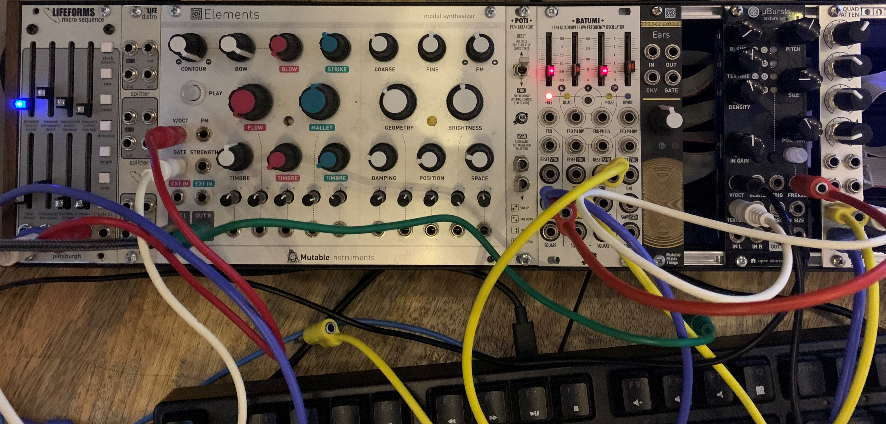

# Experiment with Elements and µBursts 2020-09-09

[Listen to experiment with Elements and Clouds Parasites (uBursts) 2020-09-17](https://mattable.bandcamp.com/track/elements-bass-cloudsresonestor-harmony-glissando-and-strum)

# Play-by-play

*Glissando between two notes for 30 seconds, then introduce a
third note for a more interesting pattern.*

I setup Resonestor Clouds using an LFO to make these three
pitches:

- a low (root) pitch and high (fifth) pitch comes from
  voltage-controlling PITCH (V/OCT) with an attenuated
  trapezoid LFO
    - these are the two notes in the beginning
    - the glissando just goes between these two notes for 30
      seconds
- a middle pitch comes from the LFO trapezoid direct to
  FREEZE

*I connect the trapezoid LFO to FREEZE at the 36-second mark.
There's an unfortunate couple of notes triggered that sound
really out of place with the gentle glissando.*

Notice from this point that a third note is introduced and the
cycle is not a simple up/down/up/down bewteen root and fifth. Now
it is:

- glissando up from root to third
- hold third for a while
- glissando up to fifth
- glissando back down to root

The interaction between the LFO and the FREEZE creates this
interesting pattern between the three pitches.

*At 2:30 a harmony voice is introduced*

This is still just Clouds! I make this harmony by turning up the
BLEND.STEREO from off to 12 o'clock.

*At 2:55 this second voice gets an extra harmonic by turning
BLEND.STEREO to full CW.*

At 3:36, Resonestor starts plucking and the Elements bass line
comes in at the same time.

Clouds is playing three voices now: a two-note harmony glissando
and a strumming that is in rhythm with the Elements bass line!

The plucking comes from the connection from Lifeforms GATE to
Clouds TRIGGER. BLEND.REVERB controls the type of pluck/strum:

- Clouds strums in Rhythm with the Elements bass line if
  BLEND.REVERB is full CCW
- Clouds does a broken-druken-strum if BLEND.REVERB is full CW

The Elements voice was already turned up in the mix, so when I
hit the `run` button on Lifeforms to start the sequence, Clouds
was getting triggered to strum and Elements was getting triggered
to play the bass line.

At this point all voices are going and I just occasionally tweak
the POSITION of the Elements bass line to get harmonics in
there, and the CONTOUR and BOW to go between a percussive bass
and an organ bass.

# Setup

## Lifeforms micro sequence

- tap `clock` to set rapid tempo
- set `scale` to microtones so that the notes can be tuned to
  the same key as the three pitches made by Resonestor Clouds
    - get the pitch first on Clouds because it is impossible to
      attenuate the Batumi LFO to get Clouds in tune with the
      microsequence, but it is pretty easy to tune the
      microsequence to match the key of the two notes generated
      by the LFO
- set `length` to seven notes
    1. note 1
    2. note 2 (higher than note 1)
    3. note 1
    4. mute
    5. note 1
    6. note 2
    7. mute
- I don't know what the exact notes are, but I know it is in
  the same key as the Clouds voices
- connect `gate` out to Elements `GATE`
- connect `gate` out to Clouds `TRIGGER`
    - with this input, Clouds is in Resonestor mode is an
      independent voice from Elements
    - by using the same gate signal for Elements and Clouds and
      independently adjusting the pitch of each
- connect `pitch` out to Elements `V/OCT`

## BATUMI 1974 Quadruple Low Frequency Oscillator
- exclusively used for modulating Clouds, no modulation of
  Elements by LFOs

## Elements
- Elements provides a bass line
- the bass line comes from the Lifeforms, the tambre of the bass
  is shaped by Elements. I go from plucky to organ by adjusting
  CONTOUR and BOW.
    - `CONTOUR` at full CW
        - full CW and CCW are short sounds, 12 o'clock is a long
          sound
        - full CW has a more round attack and decayu than full
          CCW
- `BLOW` is full CCW (off)
- `STRIKE` is 10 o'clock
- `BOW TIMBRE` at 12 o'clock
- `BLOW TIMBRE` and `STRIKE TIMBRE` at *almost* full CCW
    - `STRIKE TIMBRE` almost at minimum: this softens the attack
      of the sound, better for a driving bass line and less of a
      punchy repetitive sound
- `FLOW` at *almost* full CCW
- `COARSE` at 10 o'clock (controls pitch)
- `FINE` at 12 o'clock
- `FM` does not matter
- `GEOMETRY` at 10 o'clock (also affects pitch)
- `BRIGHTNESS` at 12 o'clock
- `POSITION` at full counter clockwise
- `SPACE` at 9 o'clock (before 12 o'clock to avoid the
  *algorithmic reverberator*: do not want reverberation on the
  dry track)
- `OUT L` to mixer channel 1 (this is the bass line)

## Clouds Parasites
- `Resonestor mode`:
  <https://mqtthiqs.github.io/parasites/clouds.html#resonestor>
    - long press: LEDs 1, 3, and 4 flash orange (numbered from
      bottom to top)
- `8s` audio:
    - short press: LED 4 is red
- in this mode, interesting things happen:

1. Start self-oscillation with `DENSITY` and `FREEZE`
    - with `DENSITY` at full CW, pressing the FREEZE button
      (doesn't matter if it stays on, just the act of *pressing
      it*) generates enough voltage to kick the mode into
      self-oscillation
    - kill the oscillation by returning `DENSITY` to full CCW
    - resume oscillation by returning `DENSITY` to full CW and
      kicking it again with the FREEZE button
    - instead of pressing the `FREEZE` button, connect `FREEZE`
      to the output of the same LFO that drives `TEXTURE` (but
      connect FREEZE direct to the LFO). Serendipitous voltages
      make it that when the LFO turns `FREEZE` on, the voltage is
      about a third. When the LFO drops back down, it turns
      `FREEZE` off and the pitch *stays* at the third. When the
      LFO comes back up, it turns `FREEZE` on, but now it carries
      the pitch up to the fifth! And on when it goes back down it
      returns to the root. So with this simple setup, there are
      now three notes: third for two long moments, fifth then
      root for the same timespan as the third lasted.

2. Create a harmony with the `STEREO` BLEND setting
    - turn up the `STEREO` BLEND to 12 o'clock, or to max to get
      some nice overdriven overtones in this harmony voice
    - honestly I can't completely understand how this works
    - sometimes the note is the same, sometimes it jumps,
      sometimes it's higher, sometimes lower
    - but it's always a harmony to the self-oscillating note

- `BLEND` sets:
    - with all blends fully CCW (LEDs are off), a single pitch is
      present, this pitch is modulated by V/OCT connected to a
      slow trapezoid LFO form the Batumi. The pitch oscillates
      between two notes with a slow glissando, but thanks to
      freeze, the pitch actually oscillates to a middle note as
      well! The LFO for controlling V/OCT must be attenuated to
      hit the desired low and high pitch, but the same LFO drives
      `FREEZE` tohit the middle the pitch. The PITCH knob is at 1
      o'clock and the attenuator is at 8 o'clock (very
      attenuated). Attenuation affects both the low and high
      pitch, so:
        - What is really needed is attenuation plus an offset
          control, and with the option to lock the lowest voltage
          of the waveform to the offset level.
        - It would also be nice to have a waveform that spends
          some time at the midpoint, though I'm somehow getting
          that by connecting to FREEZE
    - To prove this is a self-oscillation I start with pressing
      FREEZE (on or off), I clear the Clouds memory buffer by
      switching audio lengths. The pitch is gone. I excite by
      hitting FREEZE button, pitch comes back.
      I can pull the input from CLOUDS and the pitch is still
      there.
      The other critical setting for this oscillation is DENSITY
      full CW.
    - turn up the STEREO blend to get the harmony, the harmony
      also moves, but not in an obvious way, absolutely amazing
    - turn up the REVERB blend -- in Resonestor this controls
      pluck-style: full CCW is perfectly synchronous plucks, full
      CW is more broken up random plucking, I have to adjust this
      manually if I want it to change because I can't seem to get
      CV to control it on the BLEND CV input. If I have to pick
      one, the more random plucking is more interesting.

- `ELEMENTS` `OUT R` to `CLOUDS` `IN L`
    - again, this does not need to be connected to get the
      oscillation going, just need the connected to `FREEZE` and
      an LFO to ping `FREEZE` once (or unplug `FREEZE` and start
      the oscillation by tapping the `FREEZE` button on, and
      patientily waiting a second)
- `CLOUDS` `OUT L` to mixer channel 2 (this is the first voice and last voice heard)
- *slow* LFO from the `BATUMI`:
    - Sine out to attenuator at 10'oclock, to CLOUDS TEXTURE,
      TEXTURE at 12 o'clock
    - Trapezoid out to:
        - FREEZE
        - attenuator at 8 o'clock, attenuator to CLOUDS V/OCT
